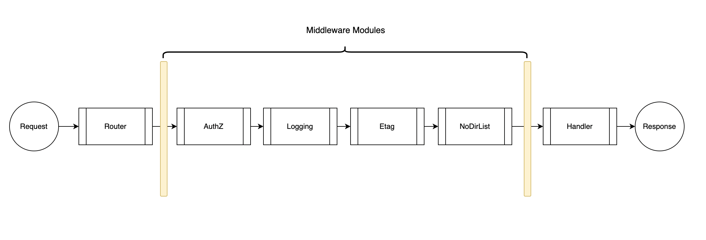
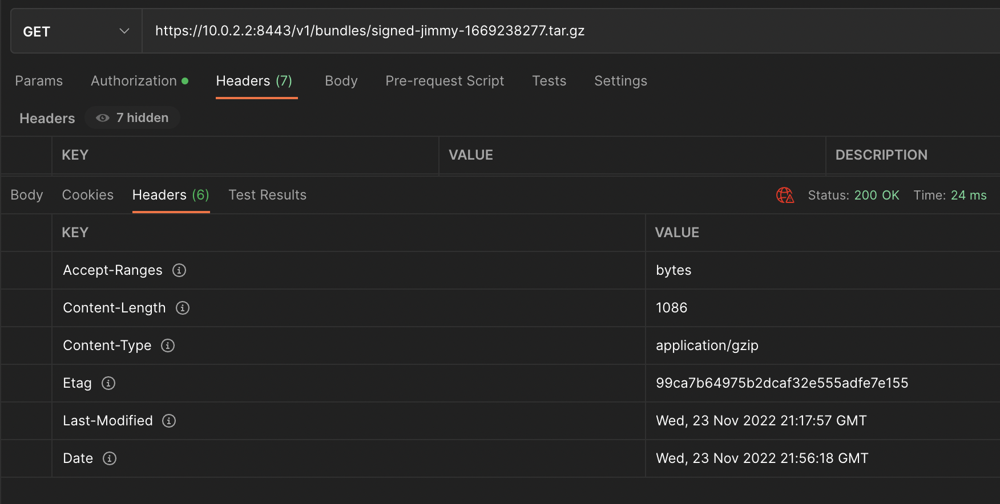

# OPA Go Bundle Server
## [EXPERIMENTAL POC - Not Production Ready]
For me, the best way to learn is to do. So, I am experimenting with this bundle server POC.

This project is a an OPA bundle server written in Go. The HTTP server uses [gorilla/mux](https://github.com/gorilla/mux) for routing and middleware, [logrus](https://github.com/sirupsen/logrus) for logging, and [OPA Bundle Go Libraries](https://github.com/open-policy-agent/opa/bundle) for bundle operations.

---
## Features
- Uses JSON to configure the server at startup
- Creates bundle files from Rego and JSON files on disk
- Creates bundle .manifest files
- Signs bundles
- Timestamps bundles
- Create Etag headers for bundle files, based on MD5 hash of bundle file content (JSON and Rego)
- Bearer token AuthZ (JWT processing checks secrets, as well as claims)
- Internal bundle registry
- File server supports Etag headers
- Endpoints include health, info, and bundle files
- HTTPS/TLS
- Graceful shutdown with SIGNINT and SIGTERM

---

## Middleware

The bundle server uses gorilla/mux middleware modules add 4 layers of request processing:
- AuthZ
- Logging
- Etag
- Directory protection


---
## Getting Started
1. The server uses a [config file](./server-config.json)

2. In debug mode, the server starts with the following logs.

```
{"args":["./main.bin"],"id":"","level":"info","logLevel":"debug","mode":"init","msg":"Service started successfully.","service":"","time":"2022-11-22T21:07:54-05:00"}
{"level":"info","msg":"Flags: map[]","time":"2022-11-22T21:07:54-05:00"}
{"level":"info","msg":"Processing: bundle-material/data.json","time":"2022-11-22T21:07:54-05:00"}
{"level":"info","msg":"Processing: bundle-material/policies/policy.rego","time":"2022-11-22T21:07:54-05:00"}
{"level":"debug","msg":"bundles processed","time":"2022-11-22T21:07:54-05:00"}
{"level":"debug","msg":"Registered bundles: {Bundles:map[signed-main-1669169274.tar.gz:{Name:main Etag:642ddbafe569fcf983b02833402928dc FileName:signed-main-1669169274.tar.gz FilePath:bundles/signed-main-1669169274.tar.gz Revision:v0.1.0}]}","time":"2022-11-22T21:07:54-05:00"}
{"id":"","level":"info","mode":"run","msg":"Listening on socket 10.0.2.2:8443","service":"","time":"2022-11-22T21:07:54-05:00"}
{"level":"debug","msg":"ETag middleware enabled","time":"2022-11-22T21:07:54-05:00"}
{"level":"debug","msg":"Request logging middleware enabled","time":"2022-11-22T21:07:54-05:00"}
{"level":"debug","msg":"AuthZ secret: <SECRET>","time":"2022-11-22T21:07:54-05:00"}
{"level":"debug","msg":"AuthZ middleware enabled","time":"2022-11-22T21:07:54-05:00"}
{"level":"debug","msg":"Directory listing prevention middleware enabled","time":"2022-11-22T21:07:54-05:00"}
```

## Bundle Internals
Created bundles...
```
opa inspect bundles/signed-main-1669175190.tar.gz
MANIFEST:
+----------+-----------+
|  FIELD   |   VALUE   |
+----------+-----------+
| Revision | v0.1.0    |
| Roots    | pacbook   |
|          | somewhere |
|          | somplace  |
+----------+-----------+
NAMESPACES:
+---------------------+---------------------------------------+
|      NAMESPACE      |                 FILE                  |
+---------------------+---------------------------------------+
| data                | /data.json                            |
| data.pacbook.things | /bundle-material/policies/policy.rego |
+---------------------+---------------------------------------+

tar tvf bundles/signed-main-1669175190.tar.gz
-rw-------  0 0      0          73 Dec 31  1969 /data.json
-rw-------  0 0      0         159 Dec 31  1969 /bundle-material/policies/policy.rego
-rw-------  0 0      0         982 Dec 31  1969 /.signatures.json
-rw-------  0 0      0          65 Dec 31  1969 /.manifest
```

## Testing with Postman


## Known Issues
- A finite set of AuthZ credentials are loaded from disk


